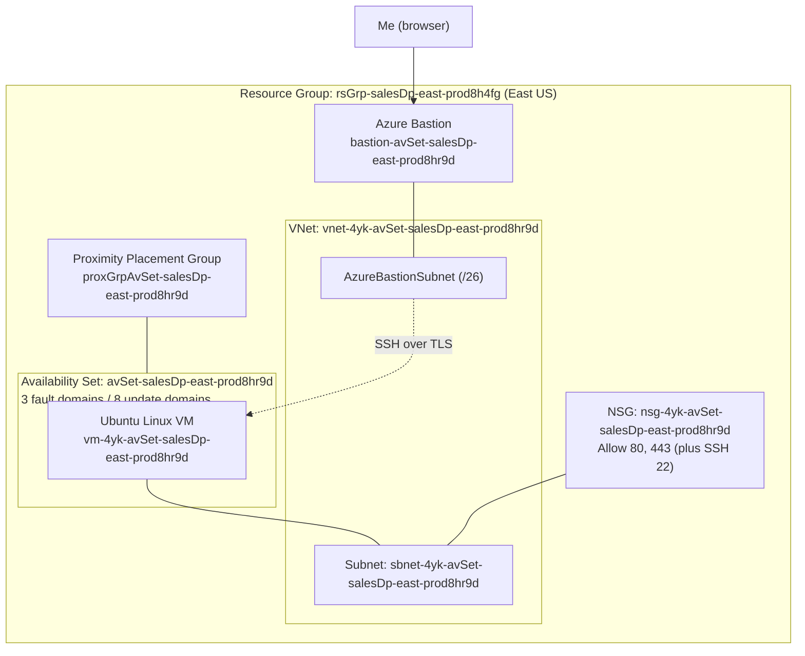
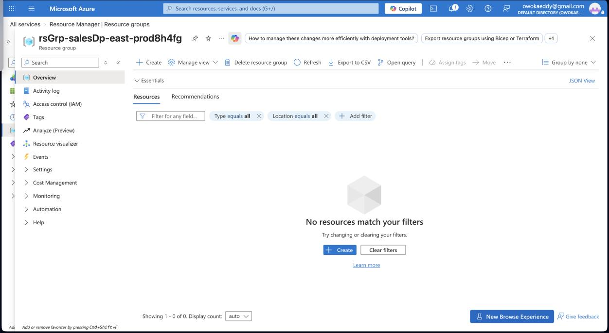
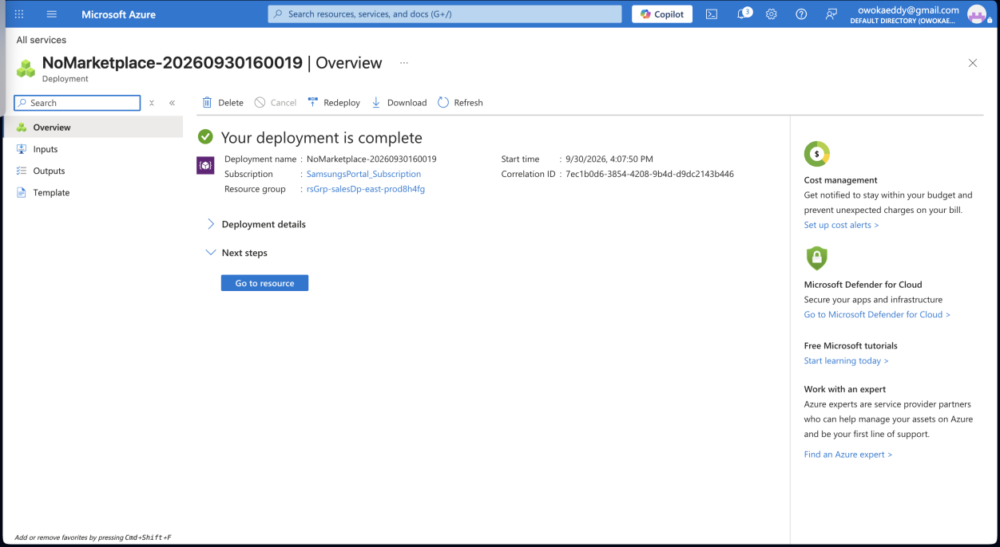
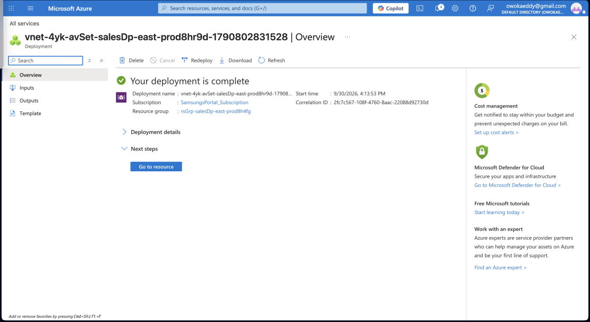
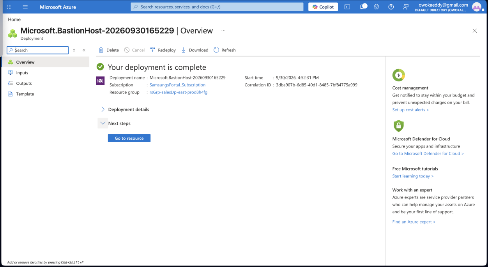
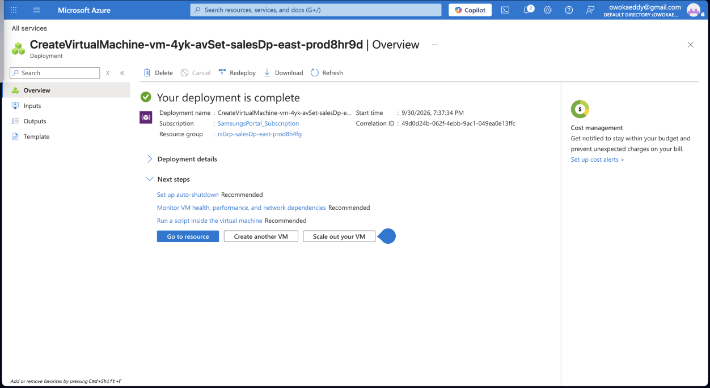
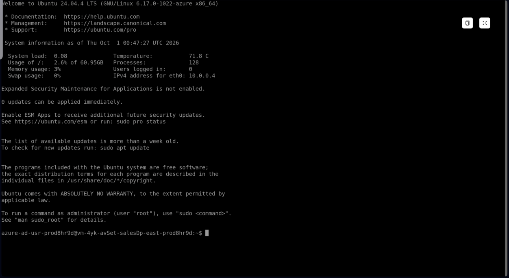
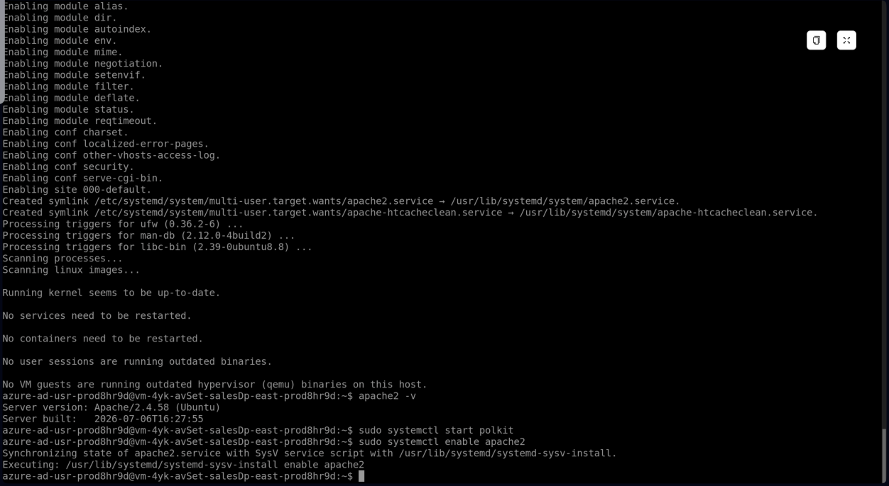
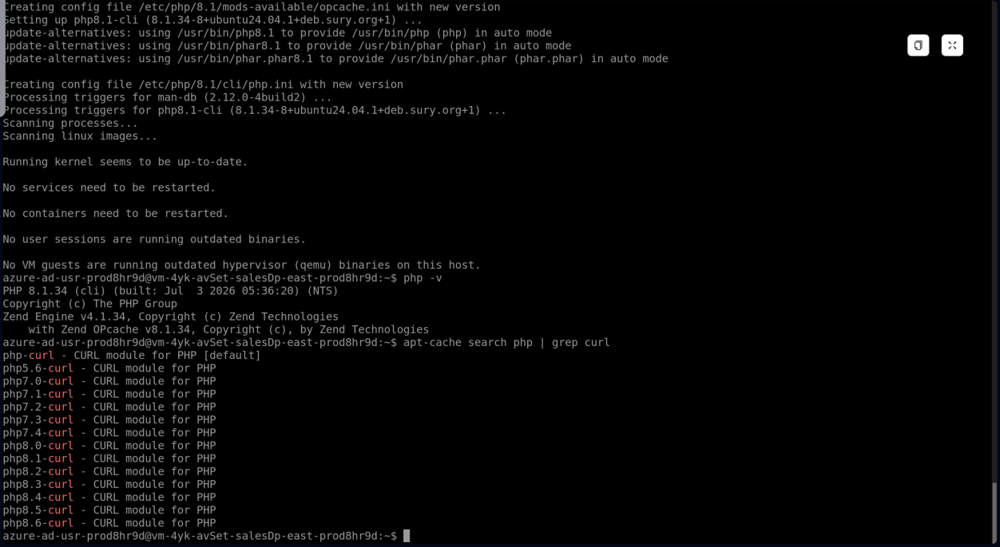

# Lab 02: Highly Available Linux VM with Azure Availability Sets

**Author:** Edward Owoka | **Role:** Azure Cloud Engineer | **Region:** East US

Deploy a Linux virtual machine into an Azure Availability Set, administer it securely through Azure Bastion, and install and verify Apache and PHP.

---

## Business Scenario

EcoEnergy Solutions Ltd. is a fast-growing renewable energy company migrating its on-premises Linux application servers to Azure. To limit downtime during planned maintenance and unexpected hardware failures, the company wants to use **Azure Availability Sets** to improve the resiliency of its VM infrastructure.

My task was to design and deploy a Linux VM inside an Availability Set, lock down the networking, administer the server remotely, install Apache and PHP 8, and validate that everything works.

## Skills Demonstrated

- Creating Azure Resource Groups with a consistent tagging strategy
- Deploying a Proximity Placement Group and an Availability Set
- Designing a Virtual Network with a dedicated Azure Bastion subnet
- Deploying a Linux VM into an Availability Set with SSH key authentication
- Configuring Network Security Group (NSG) inbound rules
- Connecting to a VM securely through Azure Bastion (no public SSH exposure needed)
- Basic Linux administration with Bash
- Installing and verifying Apache and PHP

## Architecture



## Resources Deployed

| Resource | Name |
|---|---|
| Resource Group | `rsGrp-salesDp-east-prod8h4fg` |
| Proximity Placement Group | `proxGrpAvSet-salesDp-east-prod8hr9d` |
| Availability Set | `avSet-salesDp-east-prod8hr9d` |
| Virtual Network | `vnet-4yk-avSet-salesDp-east-prod8hr9d` |
| Subnets | `sbnet-4yk-avSet-salesDp-east-prod8hr9d`, `AzureBastionSubnet` |
| Azure Bastion | `bastion-avSet-salesDp-east-prod8hr9d` |
| Virtual Machine | `vm-4yk-avSet-salesDp-east-prod8hr9d` |
| Public IP | `pip-4yk-avSet-salesDp-east-prod8hr9d` |
| Network Security Group | `nsg-4yk-avSet-salesDp-east-prod8hr9d` |
| Data Disk | `vm-avSetLab-prod_DataDisk_VideoStore` |

**Tags applied across resources:** `Department: Marketing`, `Environment: Prod`, `Cost-Center: CST-PRM85`, `Project: EcoEnergy` (plus `Team: NonProfitAppTeam` on the proximity placement group, VNet, and VM).

---

## Walkthrough

### Task 1: Resource Group

Created the resource group in East US with the four project tags. The screenshot shows the group right after creation, so it is empty at this stage.



### Task 2: Proximity Placement Group

Created the proximity placement group in East US, Zone 1, sized for a VM between 4 and 8 GB RAM. A proximity placement group keeps compute resources physically close together to reduce network latency.


### Task 3: Availability Set

Created the availability set with **3 fault domains** and **8 update domains**, managed disks enabled, and linked it to the proximity placement group.

- **Fault domains** separate VMs across different physical hardware (power and network), so one hardware failure does not take everything down.
- **Update domains** stagger planned maintenance reboots so not all VMs restart at once.



### Task 4: Virtual Network and Azure Bastion

Built the VNet with the address space changed from `/16` to `/14`, one workload subnet, and a dedicated `AzureBastionSubnet` (`/26`). Azure Bastion requires that exact subnet name. Then deployed Azure Bastion into the VNet.





### Task 5: Linux Virtual Machine

Deployed the VM into the availability set with these settings:

- **Security type:** Trusted Launch
- **Authentication:** SSH public key (generated a new key pair; the private key is stored securely and is **not** in this repo)
- **OS disk:** 64 GiB Premium SSD (P6), platform-managed key encryption
- **Data disk:** 512 GiB Premium SSD (P40), empty
- **Networking:** workload subnet, new public IP, new NSG with inbound rules for HTTP (80, priority 1010) and HTTPS (443, priority 1020) alongside SSH
- Disk, public IP, and NIC set to delete with the VM

The lab text specified Ubuntu Server 20.04, but the VM that came up reports **Ubuntu 24.04 LTS** (see the Bastion session below), so that is the version used throughout this write-up.



### Task 6: Connect with Azure Bastion

Connected from the Azure portal (VM, Connect, Bastion) using SSH private key authentication. This gives a browser-based SSH session without having to open a management port to the internet.



### Task 7: Linux Administration with Bash

Commands run in the Bastion session, in order:

```bash
users                                   # show logged-in user
echo "Hello World"                      # print text
ls -l /etc                              # list system config files
ls -a                                   # include hidden files
ls -a -1                                # one entry per line
cd / && pwd                             # go to root, confirm location
cd ~ && pwd                             # return home, confirm location
mkdir CloudItems && ls                  # create a directory
touch NewRandomFile                     # create an empty file
echo "Welcome to Linux. You created your first file with text in it." > WelcomeFile
ls -1                                   # verify files
cat WelcomeFile                         # read the file
chmod --no-preserve-root 754 WelcomeFile  # owner rwx, group r-x, others r--
cd / && pwd && ls -1                    # back to root, list contents
```

<!-- Add the Task 7 screenshot here once captured, for example:  -->

### Task 8: Install and Verify Apache

```bash
sudo apt-get update
sudo apt install apache2
apache2 -v                      # Apache/2.4.58 (Ubuntu)
sudo systemctl start polkit
sudo systemctl enable apache2   # start Apache automatically on reboot
```

Apache 2.4.58 installed and enabled to start on boot.



### Task 9: Install and Verify PHP

```bash
sudo apt-get update
sudo apt-get install software-properties-common
sudo add-apt-repository ppa:ondrej/php
sudo apt-get update
sudo apt-get install php8.1-cli
php -v                              # PHP 8.1.34 (cli)
apt-cache search php | grep curl    # confirm the PHP Curl packages
```

PHP 8.1.34 installed, and the package search confirmed the Curl module (`php-curl` and the versioned packages from `php5.6-curl` through `php8.6-curl`) is available.



---

## Key Takeaways

- **Availability Sets** protect against two failure types: unplanned hardware faults (fault domains) and planned maintenance (update domains). A single VM in a set does not get redundancy on its own. The benefit shows up when two or more VMs are in the set.
- **Azure Bastion** lets you administer VMs over TLS from the portal, so SSH does not need to be exposed publicly.
- **Consistent naming and tagging** make resources easy to find, bill, and govern in a production environment.
- **Always check what actually got deployed.** The image version differed from the lab instructions, so I documented the real version.

## Security Note

The SSH private key generated for the VM is intentionally **not** included in this repository.
